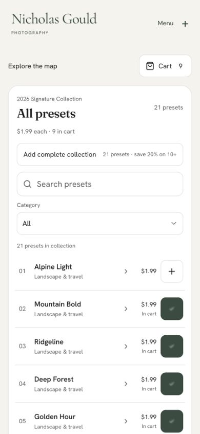
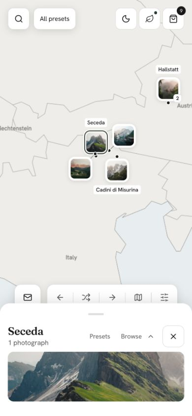
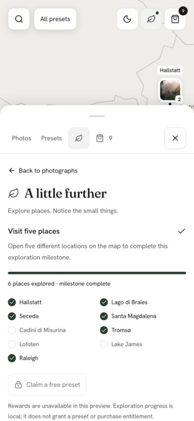
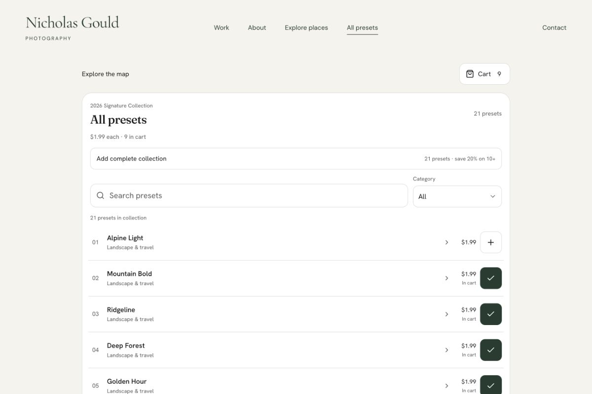
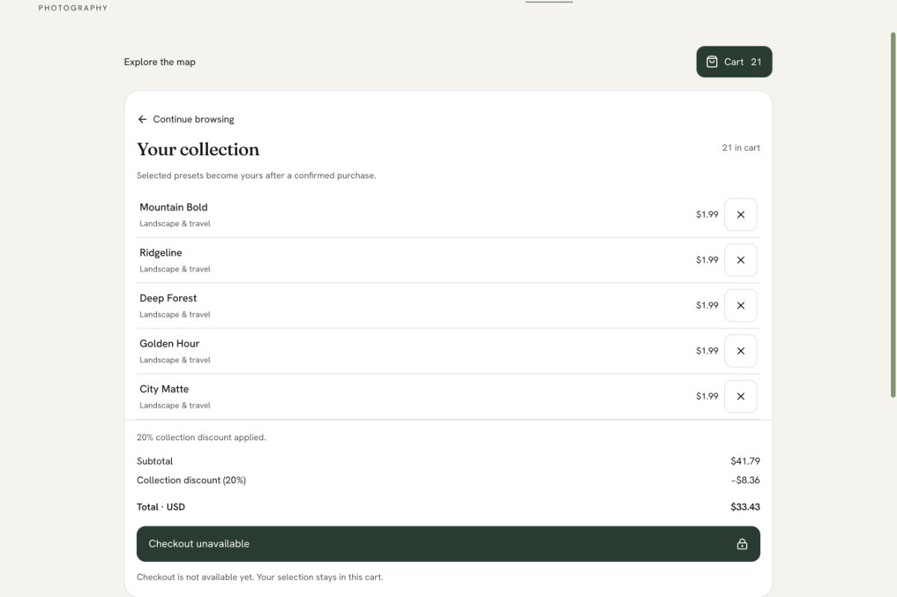
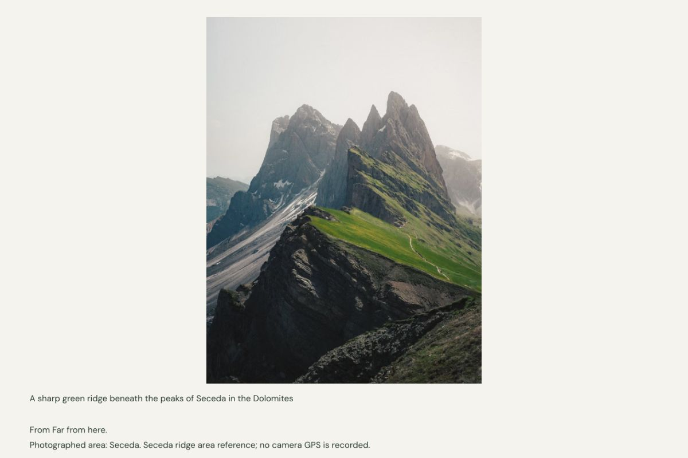

# Integrated prototype verification

October 4, 2026. Built on the verified map correction commit `0131cd3`; that exact checkpoint passed GitHub verify, Vercel and Preview Comments and was MERGEABLE with no review findings. The current feature integration retains those map changes. Hosted final-head results are recorded on the draft PR.

## Automated checks

- Node 24.20.0: `npm run lint`, `npm run typecheck`, `npm test` — passed, 128 tests, zero failures/skips.
- Default production build — passed. Controlled local launch-gate production build — passed. Final default build restored preview noindex; no persistent environment or domain changes.
- `scripts/verify-ssr.mjs` passed against both production builds: original routes and all 39 portfolio photographs, 21 server-rendered catalog links, all 69 direct detail URLs, descriptions/metadata, invalid route 404s, removed prints route, robots/sitemap and all six unconfigured commerce boundaries.
- Controlled launch configuration additionally verified every direct page’s canonical and JSON-LD, 81 unique sitemap URLs and 39 image entries. Default configuration verified noindex metadata/headers, empty sitemap, no future-domain canonical on new routes and noindex on a public image.
- Official Stripe SDK raw-signature fixtures cover tampering, stale/wrong signatures, payment/replay/refund ordering and account-bound entitlement without network calls. Durable-store absence blocks provider initialization. Server and client race tests cover reservation reuse/expiration, ownership changes, account/session changes and revoked downloads.
- Diff/secret inspection: only intended prototype sources, tests, public screenshots and docs. No XMP, buyer ZIP, private source images, credentials or local reference screenshots included.

## Supported Mac Chrome interactions

At 390×844: all 21 presets, complete collection, nine/ten-item threshold, remove, clear, empty search and focus recovery, Film search, selected detail and reload, real preset page navigation, cart persistence. All 21 total $33.43; ten $15.92; nine $17.91.

Checkout-return URL with Seceda, cart view, Film query and Classic Film detail restores cart at 75%, then restores detail and Film search. Photos returns to Seceda at 25%. Current leaf, map context and independent catalog state survive mode changes. Checkout remains visibly disabled with a retained-cart explanation.

Exploration panel shows the persisted six real places, completed five-place milestone and exact red-boat photo completion; claim is disabled and the unconfirmed dog remains Planned. Earlier direct interactions opened the five distinct leaves and red-boat photograph; integration confirms persistence and truthful boundaries.

Production browser checks: 320×640 catalog has no horizontal overflow; 842×390 cart can expand to 100% and scroll to totals/checkout; 1200×800 catalog/cart and discovery routes render correctly. Location index → Seceda → original photograph detail works. Final production complete-collection pricing and unavailable checkout were exercised again. Map gesture/filter evidence remains in `map-regression-verification.md`.

Screenshots:

- 
- 
- 
- 
- 
- 

## Limits

No real Clerk login, Stripe checkout, payment, private download, email submission or reward grant was performed. Commerce requires an approved durable adapter, provider configuration, private delivery, rate limiting and sandbox end-to-end verification. Photo/preset edit provenance, authentic before/after pairs, license/package details and dog identity remain missing. Local progress is not entitlement.

Physical iPhone pinch, Safari and the browser Animations panel at 10% speed were not run. Supported Mac Chrome interactions and automated geometry/state tests are the available evidence. No merge, production promotion, search submission, DNS update or external image upload.
